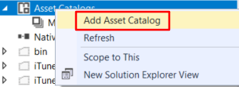
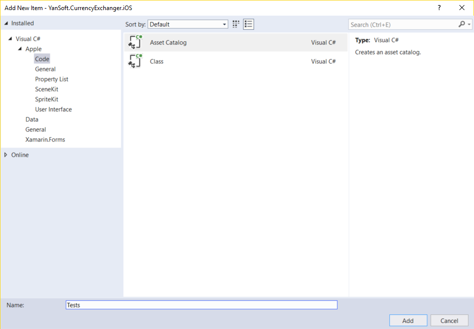
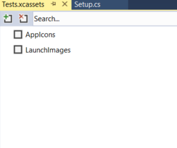
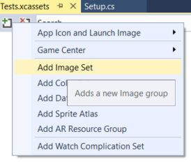
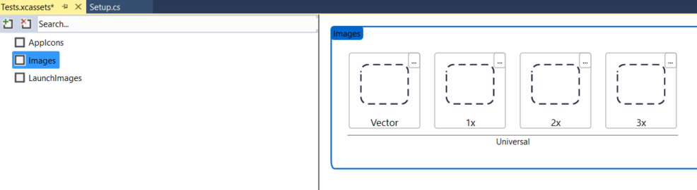
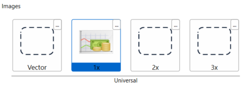
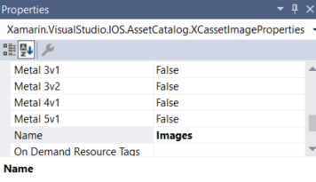
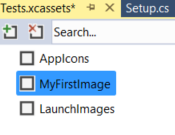
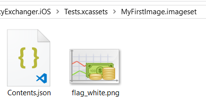
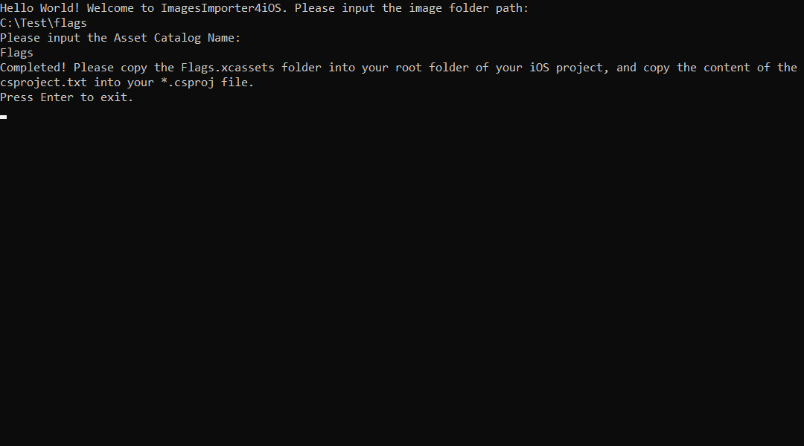

# ImagesImporter4XamariniOS
A simple console application to import plenty of images into the Xamarin.iOS project.

## Introduction

I am developing an iOS application by Xamarin.iOS and the first challenging thing to me is how to add plenty of images into the Xamarin.iOS project. I am working on a small project which can convert currencies rates and I need to show a lot of flags for currencies. When I want to add images into the Xamarin.iOS project, I found it is so boring and Visual Studio does not provide us with a convenient way to add them.

I do not want to add them one by one. Let us take a look at what happened when we add an image to the project. Then we can find some ways to automate it.

Before we started, I recommend you to read this documentation: [Displaying an image in Xamarin.iOS](https://docs.microsoft.com/en-us/xamarin/ios/app-fundamentals/images-icons/displaying-an-image?tabs=windows). So you can get a basic understanding of this topic.

## Adding an image by the editor

First, let us follow the official instruction to add an image. Right-click the `Asset Catalogs` and select `Add Asset Catalog`:



Input `Tests` as the Asset Catalog name:



Double click `Tests` in the `Asset Catalogs` folder then you will see the structure of the `Tests.xcassets`:



To add an image, click the first button on the top and select `Add Image Set`:



The editor will add an image set called `Images`, as shown below:



Now you can select images with different sizes to fit different resolutions and devices. You can also drag images directly into the editor.

For example, I select a small image file for 1x. I do not choose the others because it is just a demo.



Actually, the file name of this image is `flag_white.png`(depends on your choice). But the name of the image set in `Tests.xcassets` is `Images`. You can rename the image set by select it and update the `Name` property in `Properties` windows:



Let us rename it as `MyFirstImage`:



Now you can use the image file in your codes by this code:

```c#
MyFirstImage.Image = UIImage.FromBundle ("MyFirstImage");
```

## What happened after adding the image

Xamarin.iOS uses a different way from UWP and Android to organize the resources. Instead of using the file name, Xamarin.iOS uses `Asset Catalogs Images Sets` to specify a Json file to indicate the file names. That means your file might has a different name from it in the codes.

Ok. Next, let us find out what happened after adding the image. Right-click the Xamarin.iOS project and select `Open folder in File explorer`. You can see there is a new folder named `Tests.xcassets`. Open it and you will find a folder named `myfirstimage.imageset`. Open this folder and you will find two files, one is the original image file, another is a `Content.json` file.



Open this json file and the content looks like this:

```json
{
  "images": [
    {
      "scale": "2x",
      "idiom": "universal"
    },
    {
      "scale": "3x",
      "idiom": "universal"
    },
    {
      "scale": "1x",
      "idiom": "universal",
      "filename": "myfirstimage.png"
    }
  ],
  "properties": {},
  "info": {
    "version": 1,
    "author": ""
  }
}
```

That is it. But Xamarin.iOS must have done some other things to include it into the project. Now right click the Xamarin.iOS project and select `Unload Project`. Then right-click the project and select `Edit ***.csproj`. Now you can edit it directly.

You will find there are some sections called `ImageAsset`, like this:

```xml
    <ImageAsset Include="Tests.xcassets\MyFirstImage.imageset\Contents.json">
      <Visible>false</Visible>
    </ImageAsset>
    <ImageAsset Include="Tests.xcassets\MyFirstImage.imageset\flag_white.png">
      <Visible>false</Visible>
    </ImageAsset>
```

Now we have known what Xamarin.iOS would do after adding an image. It just imports the image into a specific folder and add a json file to specify the name of the image, then add the xml sections in the *.csproj file to include them.

## Making a tool to automate the process

Imagine that we might have a lot of images that will be added into the project. Add them one by one and update the names manually? That must be a massive work! I have heard that one of the best characteristics  of a good developer is laziness. We must not do it like this. So I write a tool to simplify the work.

First, imagine that we have some images in a folder. For simplicity, we do not need images of different sizes. We are going to import them into the Xamarin.iOS project. What I should do now is get the files list and loop them, generate the `Content.json` file and copy them into the specific folders, then generate a xml segment of the *.csproj.

I created a simple console application to generate these files automatically. First, get the image folder, then get the images in this folder. Make a loop to process these images:

```c#
        private static void GenerateResources(string assetCatalogName, DirectoryInfo currentDirectory, List<FileInfo> images)
        {
            var targetDirectory = currentDirectory.CreateSubdirectory($"{assetCatalogName}.xcassets");
            StringBuilder sb = new StringBuilder();
            foreach (var fileInfo in images.AsParallel())
            {
                var imageFolder =
                    targetDirectory.CreateSubdirectory($"{fileInfo.Name.Replace(fileInfo.Extension, "")}.imageset");
                fileInfo.CopyTo(Path.Combine(imageFolder.FullName, fileInfo.Name));
                var jsonFile = new FileInfo("Contents.json");
                string content = File.ReadAllText("Contents.json");
                File.WriteAllText(Path.Combine(imageFolder.FullName, "Contents.json"),
                    content.Replace("{filename}", fileInfo.Name));
                sb.Append(
                    $@"<ImageAsset Include=""{assetCatalogName}.xcassets\{fileInfo.Name.Replace(fileInfo.Extension, "")}.imageset\Contents.json"">");
                sb.Append(Environment.NewLine);
                sb.Append(@"<Visible>false</Visible>");
                sb.Append(Environment.NewLine);
                sb.Append(@"</ImageAsset>");
                sb.Append(Environment.NewLine);
                sb.Append(
                    $@"<ImageAsset Include=""{assetCatalogName}.xcassets\{fileInfo.Name.Replace(fileInfo.Extension, "")}.imageset\{fileInfo.Name}"">");
                sb.Append(Environment.NewLine);
                sb.Append(@"<Visible>false</Visible>");
                sb.Append(Environment.NewLine);
                sb.Append(@"</ImageAsset>");
                sb.Append(Environment.NewLine);
            }

            File.WriteAllText(Path.Combine(targetDirectory.FullName, "csproject.txt"), sb.ToString());
        }
```

Call these methods in the `Main` class:

```c#
        static void Main(string[] args)
        {
            Console.WriteLine("Hello World! Welcome to ImagesImporter4iOS. Please input the image folder path:");
            var path = Console.ReadLine();
            var currentDirectory = GetDirectory(path);
            var images = GetImages(currentDirectory);

            Console.WriteLine("Please input the Asset Catalog Name:");
            var assetCatalogName = Console.ReadLine();

            GenerateResources(assetCatalogName, currentDirectory, images);
            Console.WriteLine($"Completed! Please copy the {assetCatalogName}.xcassets folder into your root folder of your iOS project, and copy the content of the csproject.txt into your *.csproj file.");
            Console.WriteLine("Press Enter to exit.");
            var enter = Console.ReadKey();
            if (enter.Key == ConsoleKey.Enter)
            {
                Environment.Exit(0);   
            }
        }
```

It is done. Run this console application, then input the folder path and the Asset Catalog Name:



You will see all the folders are automatically generated in the target folder:


Copy the *.xcassets folders into your root folder of the Xamarin.iOS project. Open the `csproject.txt` file, and copy the content and paste it into your *.csproj file. Unload it first to edit it.

If you have some other requirements, for example, such as setting different sizes of images, you can easily edit the script to do it.
